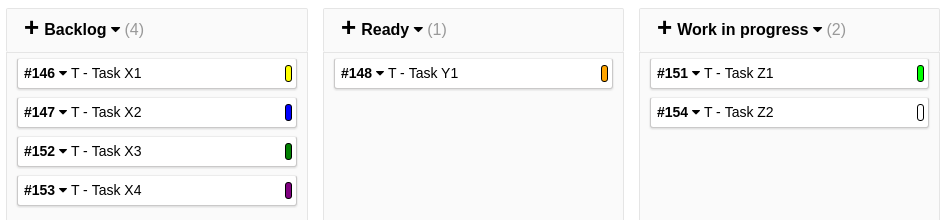
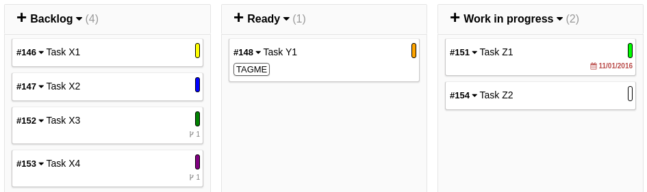

# Change color status

The following is specialized for use combined with this plugin: [KanboardCSS](https://gitlab.com/ThomasTJ/KanboardCSS)

This will change the left border color to a round icon with task color. Some special colors are not supported.

Screenshot:





## CSS
```CSS
/* == START: COLOR ON MAIN TASK == */
/* Tasks expanded */
.colorstatus-expanded{
    display: inline-block;
    float: right;
    width: 5px;
    height: 20px;
    border: black 1px solid;
    border-radius: 30px;
}
/* Tasks collapsed */
.colorstatus-collapsed{
    display: inline-block;
    float: right;
    width: 5px;
    height: 15px;
    border: black 1px solid;
    border-radius: 30px;
}
/* Padding for title */
.task-board-title{
    padding-right: 5px;
}
/* Border etc. for task */
.board-task-list>div {
    border: #cac9c9 solid 0.5px;
    border-left-width: 0.5px!important;
    border-radius: 3px;
    box-shadow: 0 1px 2px rgba(186, 186, 186, 0.55);
    background-color: #fff;
    color: black;
}
/* == END: COLOR ON MAIN TASK == */
```

## Code

Make the changes in: **task_private.php**

Add the following `<span>` after the element with `class="task-board-saving-icon"` for both expanded and collapsed:

**Collapsed:**
```HTML
<span class="colorstatus-collapsed" style="background-color: <?php print $task[color_id]; ?>;"></span>
```

**Expanded:**
```HTML
<span class="colorstatus-expanded" style="background-color: <?php print $task[color_id]; ?>;"></span>
```
